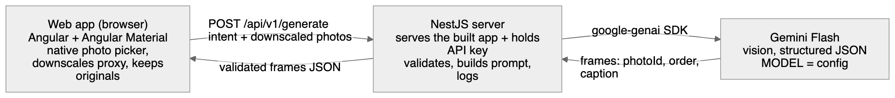
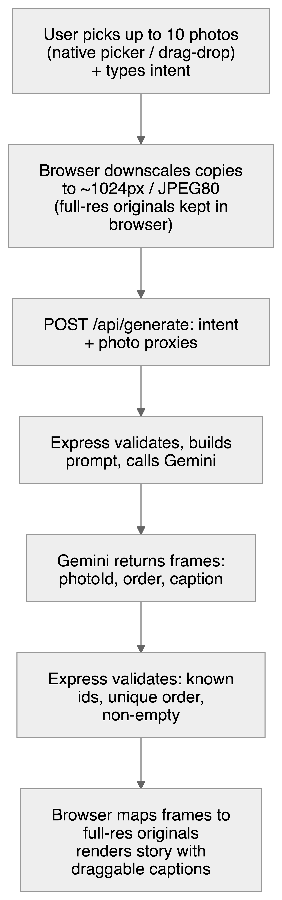
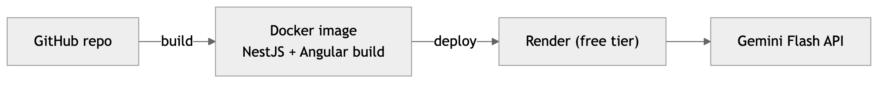

# Auto Stories — Phase 1 Architecture

How Phase 1 ([spec](spec.md)) is built and deployed: a responsive **web app** where the user uploads photos + one "What's the story?" line (+ optional tone) and gets back an ordered, captioned story, previewed with draggable captions. Reasoning lives in [`decisions.md`](../decisions.md) (Chapter 3; the story-quality decisions are Chapter 2).

## Decisions at a glance

| # | Decision | Choice |
|---|----------|--------|
| 3.1 | Where AI runs | Server-side (NestJS) holds the key; browser never sees it |
| 3.2 | Model | Gemini Flash, free tier, swappable via config |
| 3.3 | Generation shape | Single structured call (pipeline = fallback) |
| 3.4 / 2.4 | Image input | Cap 30 photos (a real dump), downscale ~1024px/JPEG80, keep originals |
| 3.5 | Stack | Angular frontend + NestJS API (one origin) |
| 3.6 | Deploy | One Docker container (NestJS serves the build + API) + `docker-compose`; hosted free on Render |
| 3.8 | State | Angular service holding the story in signals |
| 3.10 | Component library | Angular Material (+ CDK harnesses for tests) |

## System architecture



The browser never holds the API key. The NestJS server is stateless — no database in Phase 1; a story lives only in browser memory until the user exports it (Phase 2).

## Data flow (one generation)



## Components

**Frontend (Angular + Angular Material, responsive)** — tailored to look great on laptop, tablet, or phone:
- Photo **upload** — `<input type="file" accept="image/*" multiple>`: on mobile this opens the OS **native photo picker** (multi-select, Recents-first — feels native, no library-scan permission needed); on desktop, drag-drop + click-to-browse + paste.
- **EXIF timestamps** read client-side (`exifr`) as an optional soft ordering hint + caption context (ordering is narrative-first, not timestamp-first — see approach 2.1).
- **Downscale** in the browser (canvas / `browser-image-compression`) to the proxy sent to the server — images processed **one at a time** (decode → downscale → release) so peak memory stays flat on low-end phones.
- Preview: ordered photos with a draggable/resizable caption layer (Angular **CDK drag-drop**). No pixel baking in Phase 1.
- State in a small Angular **service (signals)**.

**Backend (NestJS, `POST /api/v1/generate`)** — also serves the built Angular app from the same origin (`ServeStaticModule`). Server-side, so the Gemini key stays hidden and users never bring their own key. Jobs: per-IP rate limiting + a global daily budget cap (protect the shared key), input validation (max body size, ≤30 photos, per-image size, JPEG/PNG/WebP/HEIC only, story line length-capped + delimited as data — client checks are re-done here, not trusted), prompt construction, the Gemini call (~25s timeout, typed errors, drop-flagged-photo-and-retry on safety block), output validation, logging.

**Model (Gemini Flash)** — called via the `@google/genai` SDK with `responseSchema` for guaranteed-shape JSON. `MODEL` is an env var, so a stronger model is a one-line swap.

## The generation contract

**Request** `POST /api/v1/generate`
```json
{ "story": "Maya's 1st birthday at the lake house, all the cousins came",
  "tone": "heartfelt",
  "photos": [ { "id": "p1", "b64": "<downscaled jpeg>", "takenAt": "2026-07-04T09:12:00Z" } ] }
```
`story` is the "What's the story?" line; `tone` is the optional chip; `takenAt` (EXIF) is optional.

**Model responseSchema (enforced JSON)**
```json
{ "frames": [ { "photoId": "p1", "order": 1, "caption": "..." } ] }
```

The model may **select a subset** and **reorder**, returning only chosen photos with an explicit `order`. The prompt: order by the `story` + what's visible (strongest hook first → payoff), using `takenAt` only as a soft hint; write specific (not generic) captions grounded in what's visible + the `story` and matching `tone`.

## Data model (client)

```
Photo  { id, objectURL (full-res upload), width, height, takenAt }
Frame  { photoId, order, caption, textPos {x,y}, textScale }
Story  { id, story, tone, frames: Frame[], createdAt }
```

## Deployment



- **App:** one NestJS server serves the built Angular app (`dist/`) and the `/api/v1/generate` endpoint. Provide a **`docker-compose.yml`** so reviewers can `docker compose up` in a fresh Linux container, and host the same image **free on Render** (spins down when idle; ~30-50s cold start on first hit) for a live URL — both required by the brief.
- **Secrets:** `GEMINI_API_KEY` and `MODEL` are server-side env vars only. The browser bundle contains no key.
- **Ops:** `GET /healthz` liveness endpoint (Render readiness; shallow, no Gemini call); **`helmet`** sets security headers (CSP `default-src 'self'`, HSTS, frame-ancestors, etc.); **GitHub Actions** runs lint/typecheck/tests + Docker build on every PR, and `main` auto-deploys to Render.

## Edge cases & failure modes

| Case | Handling | User sees |
|------|----------|-----------|
| No photos uploaded | Disable Generate | Greyed button + hint |
| 1–2 photos | Require ≥3; keep Generate disabled | "A story needs at least 3 photos" |
| >30 uploaded | Enforce cap at upload | "Up to 30 photos per story" |
| HEIC upload (iPhone) | Convert client-side (`heic2any`) before downscale/preview | Transparent; else "couldn't read this photo" |
| Huge / non-image file | Validate type + size at upload | "Please upload images under N MB" |
| Oversized request body (server) | Reject with 413 before processing | "That upload was too large" |
| Bypassed client checks (non-image / >10 / oversized image) | Server re-validates type, count, size; reject 400 | Generic error (the UI already prevents this) |
| Per-IP rate limit hit | Reject with 429 (rate-limit middleware, ~a few/hour) | "Slow down a moment — try again shortly" |
| Global daily cap hit (~1,200/day) | Stop calling Gemini; short-circuit 503 (protects the shared free key) | "At capacity today — try later" |
| ~2 free generations used | Client-side nudge (not enforced until Phase 3 accounts) | "Sign up to make more" |
| Network fail / timeout | Retry w/ backoff (2×), then stop | "Couldn't reach the story engine — retry" |
| Model returns invalid JSON | `responseSchema` + parse guard; 1 stricter retry | Error copy if still bad |
| Model returns unknown photoId | Server drops unknown ids, keeps valid frames | Story with valid frames only |
| Model returns 0 usable frames | Typed empty result | "Couldn't shape a story — try different photos" |
| Gemini quota/rate-limited (429) | Typed `quota_exhausted` / `rate_limited`; not retried | "At capacity today — try later" |
| Gemini flags an image (safety) | Drop that photo, re-call with the rest (partial story); hard-fail only if <3 remain | Partial story, or "Couldn't use some photos — try different ones" |
| Gemini call hangs | Hard ~25s timeout → typed `timeout` | "The story engine timed out — retry" |
| Generic / weak captions | Prompt forces specificity; Regenerate + inline edit | Regenerate + edit |
| Double-click Generate | `generating` signal disables the button + guards the handler; second fire is a no-op | Button in loading state |
| Slow generation | Staged loader | "Reading photos… ordering… writing captions…" |

## Observability

The NestJS server logs per request (structured JSON via Pino): `requestId`, `model`, photo count, `latencyMs`, token usage, outcome (`ok` / `partial` / `invalid_json` / `empty` / `quota_exhausted` / `rate_limited` / `safety_blocked` / `timeout` / `upstream_error`). Makes "the model was wrong" visible instead of silent. Client-side failures (upload / decode / render) are caught by a global Angular `ErrorHandler` + `unhandledrejection` hook and POSTed to a server log endpoint, so browser breakage lands in the same stream (and the UI shows a "something went wrong" fallback, not a blank screen).

**Where it goes (Render):** everything logs to **stdout/stderr**; Render captures the container's output into its **Logs** tab — a live, searchable tail, no agent to run. Free-tier logs are **ephemeral** (short retention, lost on restart/spin-down, no alerting) — fine for a take-home, not production-grade. Upgrade path (not built): **Render Log Streams** forward stdout to an external aggregator (retention, search, alerts) + **Sentry** for error tracking. Same log lines, no app change. See approach 4.12.

## Testing strategy

Model is non-deterministic, so test **plumbing deterministically**, **quality separately**:
- **Unit** — downscale util, prompt builder, response validator (schema, unknown ids, duplicate order, empty caption).
- **Component** — Angular components via **CDK component harnesses** (upload, preview, caption drag/edit).
- **Contract** — NestJS `/api/v1/generate` against mock Gemini responses (valid / malformed / hallucinated id / empty) → each maps to the right outcome.
- **E2E** — Cypress/Playwright: upload → generate → render against a stubbed API.
- **Quality eval** — fixed sample photo sets + story lines/tones → real model → rubric-score ordering + caption specificity. Run on model/prompt change.

The deterministic suites (unit / component / contract / E2E) run in **CI** (GitHub Actions) on every PR (approach 4.9).

## How this extends to Phase 2 & 3

- **Phase 2 (get it onto Instagram)** — render each `Frame` (original + positioned caption) into a 1080×1920 image the user **downloads** (or shares via the Web Share API on mobile), then posts from their phone. No server change. Adds a music-suggestion field to the same response.
- **Phase 3 (recurring journal)** — email/push reminders on a cadence; a web app can't auto-scan a photo library, so the user re-uploads when nudged — one tap into the same native photo picker (Recents-first makes grabbing the period's photos quick). Adds light persistence + accounts.

The architecture is a straight line (browser → one API route → model), so Phases 2–3 bolt on without a redesign.
