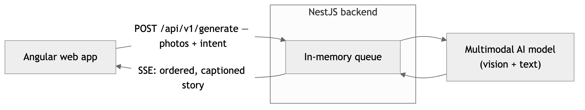

# Auto Stories — Spec · Phase 2: Get it onto Instagram

Phase 2 takes the finished story from [Phase 1](../phase-1/spec.md) and gets it posted. Built only once Phase 1 produces a story worth posting.

## Goal
Move a finished story from the app onto the user's Instagram Story with the least friction, without needing Instagram API approval.

## Scope

**In scope:**
- **Longer stories — up to 30 photos, generated async.** Raise the pick from 10 to 30 so the user hands over a full camera-roll dump and the AI *selects* the best frames, not just orders a pre-trimmed set (the value in [approach 2.4](../decisions.md#24-how-many-photos-can-the-user-bring-in)). Generation runs as a background job so it can't hit Render's request timeout: `POST /api/v1/generate` returns a `jobId` immediately, an in-memory queue with one worker runs the model call, and the finished frames are pushed back over **Server-Sent Events**. Per-image proxies are downscaled harder so 30 stay under the request body cap. (Reasoning: [decisions.md Chapter 6](../decisions.md#chapter-6--phase-2-longer-stories-without-timing-out).)
- **Build the finished frames** — in the browser, render each frame (photo + placed caption) into a shareable 1080×1920 image.
- **Deliver the frames** — download the images (on desktop) or share them via the **Web Share API** (on mobile browsers), getting the finished frames onto the user's phone.
- **Post via Instagram's multi-select** — the user saves the frames to their gallery, opens Instagram, taps "Select Multiple," and posts them as sequential story cards. Human-in-the-loop by design. (A web app can't deep-link into Instagram's composer the way a native app could, so this is a couple of taps more.)
- **Music suggestions** — the app reads the story's vibe and tells the user what to search for in Instagram's music tab (mood, genre, example tracks), so adding music there is effortless. Just generated text.
- **Don't lose work on refresh** — persist a local draft (story state + downscaled proxies) to **IndexedDB**, restored on next open in the same browser, plus a `beforeunload` warning. Stabilizing, so it lands in Phase 2 rather than the Phase 1 core (see approach 4.6). Cross-device sync needs accounts → Phase 3.

**Out of scope:**
- **Automatic / direct posting via the Instagram API** — needs a Business account + Facebook Page + Meta App Review; too heavy. Hand-off instead.
- Music (audio), animated GIFs, interaction stickers — the user adds these in Instagram.

## System architecture

Generation is a background job so a 30-photo run can't hit Render's request timeout. `POST /api/v1/generate` enqueues the work in an **in-memory queue** (one job at a time — the free tier is a single container) and the finished story is pushed back over **Server-Sent Events**. For >10 photos the worker runs a **describe-then-decide pipeline** — `ceil(N/10)` describe-and-rate calls over batches of ≤10 images, then one call that ranks all of them on one bar, selects 5–7, orders (EXIF capture time as a soft hint), and captions; ≤10 photos stays the Phase 1 single call. (Full reasoning: [decisions Chapter 6](../decisions.md#chapter-6--phase-2-longer-stories-without-timing-out).)

## Why hand-off, not API
Publishing programmatically requires a Business/Creator account, a linked Facebook Page, and Meta App Review (weeks). Personal accounts are excluded. The hand-off needs none of that and keeps the user in control of the final post. (Full reasoning in `decisions.md`.)
